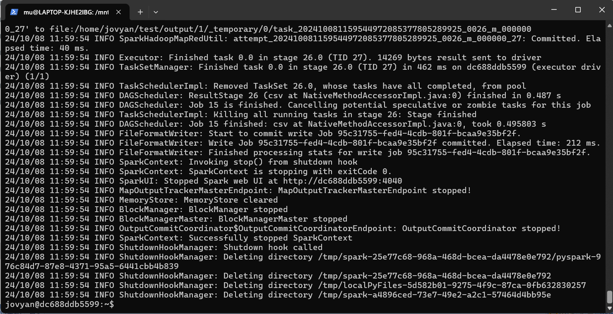

### Methods
* There are data with `point_hotzone.csv`, `zone-hotzone.csv`, `yellow_trip_sample_100000.csv`, Spark command as:
    ```bash
    spark-submit --py-files HotzoneAnalysis.py Entrance.py test/output/ hotzoneanalysis src/resources/point_hotzone.csv src/resources/zone-hotzone.csv hotcellanalysis src/resources/yellow_trip_sample_100000.csv
    ```
* Run CLI
     
* Results
    1. [HotzoneAnalysis](./output/0/part-00000-2cb55e57-e4ee-4838-9d92-71b22e9dc18a-c000.csv)
    2. [HotcellAnalysis](./output/1/part-00000-047f5027-c089-43fd-8628-780bae38dedd-c000.csv)
* Env. Ver.
    * Python 3.11.6
    * Spark 3.5.0
    * Pyspark 3.5.0
    * Java 17.0.8.1
    * [jupyter/all-spark-notebook](https://hub.docker.com/r/jupyter/all-spark-notebook)